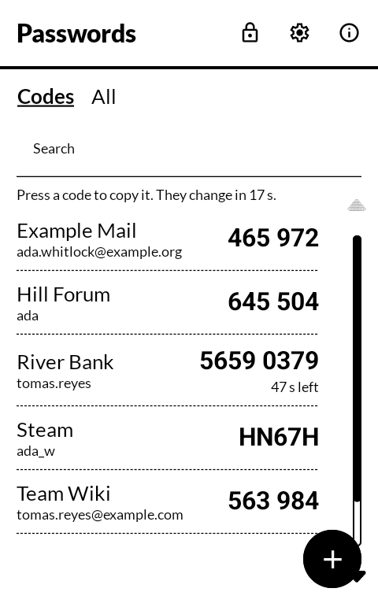
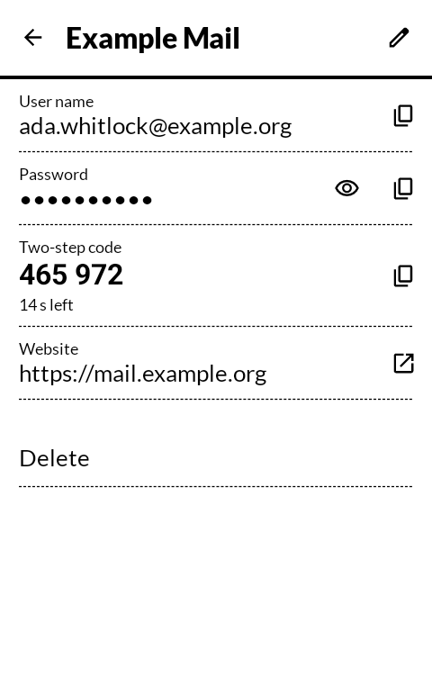
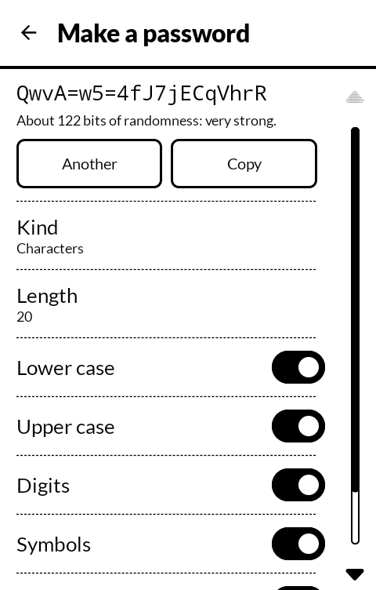
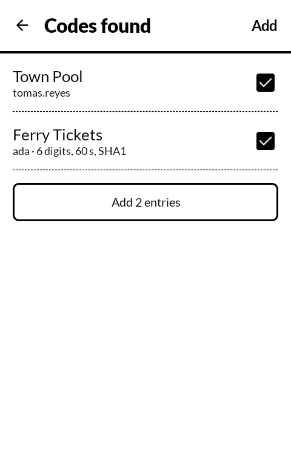

# 合言葉 aikotoba — Passwords

Sign-ins and their two-step codes, kept in a KeePass file. Open the file with your master
password, copy a password or a code, or let other apps fill their sign-in screens from it. Built
for the [Mudita Kompakt](https://mudita.com/products/kompakt/), and it will install on any
Android 12 device.

*Aikotoba* is 合言葉 — a watchword, the word that lets you through.

| | |
|---|---|
|  |  |
|  |  |

## What it does

- **Opens a KeePass (KDBX 3 or 4) file** wherever it lives: a folder on the phone, the folder
  Nextcloud or Syncthing keeps in step, a Samba share or a Nextcloud through Files. The same file opens in
  KeePassXC on a computer, and changes made in either show up in the other.
- **The keyboard's Done key unlocks.** Type the master password and press the key; there is no
  second press. A key file, if the vault uses one, is chosen once on the same screen.
- **Two-step codes beside the passwords.** Each entry can carry its code the way KeePassXC and
  KeePassDX keep it (an `otp` field holding an `otpauth://` link; KeePassXC's older `TOTP Seed`
  fields are read too). The Codes list shows every one; press a code to copy it. TOTP with
  SHA-1, SHA-256 or SHA-512, any number of digits and seconds, counter-based HOTP, and Steam
  Guard. A search beside *Codes* and *All* narrows the list by name, issuer or account as you
  type. Each time the codes change, the phone gives one short tick while they are on screen
  (Settings can turn it off; it follows the phone's own touch vibration setting).
- **Adds a code** by scanning its QR code with the app's own scanner, which reads the camera's
  live picture and goes on to the code as soon as one is in view, with nothing to press; from a
  picture already on the phone; from a pasted `otpauth://` link; or from the secret typed by hand.
- **Brings codes in from other authenticators:** a kAuth backup (opened with kAuth's own master
  password) or kAuth's exported list, an Aegis export without a password, and Google
  Authenticator's transfer codes. Google's transfer format has no place for how often a code
  changes, so every code arrives as a 30-second one; the app says so, and a 60-second code from
  it needs its step set once under Edit.
- **Makes passwords:** characters, of a length and from the sets you choose, with the
  look-alikes (l I 1 O 0 o) left out if you like; or words from the EFF's large word list, with
  the separator you choose. The strength is shown as the bits of randomness it really has.
- **Copies with a clock on it.** A copied password or code is taken off the clipboard thirty
  seconds later, and it is marked sensitive so a keyboard that keeps a clipboard history leaves
  it out.
- **Fills sign-ins in other apps** (Android's autofill). Entries are offered to a page in a browser
  whose address is theirs, and to an app that the entry names; anything else is a search away,
  and a sign-in picked by hand can be remembered for that app. A web page shown inside some other
  app counts as that app, since the app can read what is filled into it. While the vault is locked the offer is
  a single line that unlocks it.
- **Locks itself** when the screen goes dark, and after a few minutes away from the app (on
  leaving, 1, 5 or 15 minutes). No screenshots, nothing in the Recents picture.
- **Opens with a fingerprint**, if you ask it to in Settings. The master password is then kept
  encrypted by a key in the phone's secure key store that only a registered finger can use, the
  way KeePassDX does it; a fingerprint added or removed on the phone destroys that key, and the
  password is asked for once again. The password field is always there beside it, and turning
  the setting off deletes the key and what it kept.

## The file is the backup

There is no cloud of this app's own, and no account. The vault is one file, and that file is
the only copy unless you make another. Keep it in a folder that something copies elsewhere
(Nextcloud, Syncthing, a share), or use **Settings → Save a copy** now and then. A copy stays
locked with the same master password. Forget that password and nobody can open the file,
this app included.

Saving is careful, because of that:

- Before writing, the file is read again. If another phone or computer saved it since it was
  opened, nothing is written; you choose to open the newer file, save yours as a copy, or replace
  theirs.
- What is about to be replaced is kept inside the app first, and **Settings → Put back the file
  from before the last save** restores it.
- The new file is written whole, flushed and read back, and anything but an exact match puts the
  old one back. If the phone dies part way, the next unlock says so and offers the copy from
  before.

Every save runs the vault's key derivation again (KeePass changes the file's salt on each save),
so a save takes as long as an unlock.

## What it does not do

- **Nothing leaves the phone through it.** The app has no internet permission. It does not
  sync; whatever already syncs the folder does.
- **The camera only for scanning.** The permission is asked the first time a code is scanned,
  the picture is read as it comes and nothing of it is kept, and a picture already on the phone
  still works without it.
- **Not saved from other apps.** Filling never offers to save what you typed elsewhere.
- **A read-only vault stays read-only.** A file the app was only allowed to read (a server's
  file through Files before its version 0.3.0, for one) is not written; the list says so at the
  top, changes are kept while the vault is open, and pressing that line saves the vault to a
  file you choose, which becomes the vault. From Files 0.3.0, a vault on a Samba share or a
  Nextcloud, chosen through Files in the system's file picker, is saved back to the server, and
  Files refuses to replace it if another device saved it meanwhile.

## On the Kompakt: DuraSpeed

DuraSpeed, the Kompakt's background manager, can stop apps it is not told to leave alone, and a
stopped app's fill service is not started for other apps. If the fill list stops appearing,
open **Settings → If fill stops appearing**, press *Open*, and switch Passwords on in DuraSpeed's
list.

## Moving from kAuth

1. In kAuth, make an encrypted backup. It is locked with kAuth's master password.
2. In Passwords, open or make a vault, then **Settings → Bring in codes → From another
   authenticator**, and choose the backup. kAuth's master password opens it here once; it is not
   kept.
3. Tick the codes to bring in and press *Add*. Each becomes an entry with its code.
4. Check one or two codes against the sites, then delete the kAuth backup file if it is no
   longer wanted.

## Building

```
./gradlew assembleDebug
./gradlew testDebugUnitTest
```

A release build needs a keystore at `signing/signing.keystore` with a matching
`signing/signing.properties`. There is no fallback key in this repository: without one, a
release build comes out unsigned rather than wrongly signed.

`tools/make-test-vault.py` makes the test vaults with pykeepass, a KeePass implementation
independent of the one inside the app.

## Getting it, and keeping it

Download <https://github.com/wanderwildwood/aikotoba/releases/latest/download/aikotoba.apk> and
sideload it. That address always points at the newest release, and every release publishes a
`.sha256` beside the APK if you would rather check than trust.

For updates without doing this by hand, add this repository to
[Obtainium](https://github.com/ImranR98/Obtainium):

    https://github.com/wanderwildwood/aikotoba

## Whose work is inside

- [kotpass](https://github.com/keemobile/kotpass) (MIT) reads and writes the KeePass files.
  None of the vault's cryptography is written in this app.
- [Argon2Kt](https://github.com/lambdapioneer/argon2kt) (MIT), around the reference
  [Argon2](https://github.com/P-H-C/phc-winner-argon2) in C (CC0), derives the key, so a vault
  tuned on a computer opens in seconds on the phone.
- [kAuth](https://github.com/ok1cdj/kAuth) by Ondrej Kolonicny (OK1CDJ) (GPL-3.0-or-later):
  the code generation, the `otpauth://` and Google Authenticator transfer readers, and kAuth's
  backup format are its own files, under `com/ok1cdj/kauth/core`, with their notices. One change,
  marked in the file: kAuth's Argon2id is reached through the same native Argon2.
- [Calm QR](https://github.com/jacobrmoss/calm-qr) by Jacob Moss (Apache 2.0): the QR scanner,
  its live camera picture and the way it focuses on a code, under `com/caravanfire/calmqr` with
  its notice and licence. Changed, as the file says: it reads with ZXing in place of Calm QR's
  own Rust decoder.
- [ZXing](https://github.com/zxing/zxing) (Apache 2.0) reads QR codes, in the camera's picture
  and in pictures on the phone. [CameraX](https://developer.android.com/jetpack/androidx/releases/camera)
  (Apache 2.0) runs the camera.
- The [EFF large word list](https://www.eff.org/dice) (CC BY 3.0) for passphrases.
- [MMD](https://github.com/mudita/MMD) (Apache 2.0), Mudita's design system, and icons from
  Material Symbols (Apache 2.0).

## Licence

GPL-3.0-only. See [LICENSE](LICENSE).

Copyright (C) 2026 wander wildwood

This program is free software: you can redistribute it and/or modify it under the terms of the
GNU General Public License as published by the Free Software Foundation, version 3.

This program is distributed in the hope that it will be useful, but WITHOUT ANY WARRANTY;
without even the implied warranty of MERCHANTABILITY or FITNESS FOR A PARTICULAR PURPOSE. See
the GNU General Public License for more details.

You should have received a copy of the GNU General Public License along with this program. If
not, see <https://www.gnu.org/licenses/>.

The kAuth files keep their own GPL-3.0-or-later notices, which allow them here. The Calm QR
file keeps its Apache 2.0 notice, with the licence beside it.
